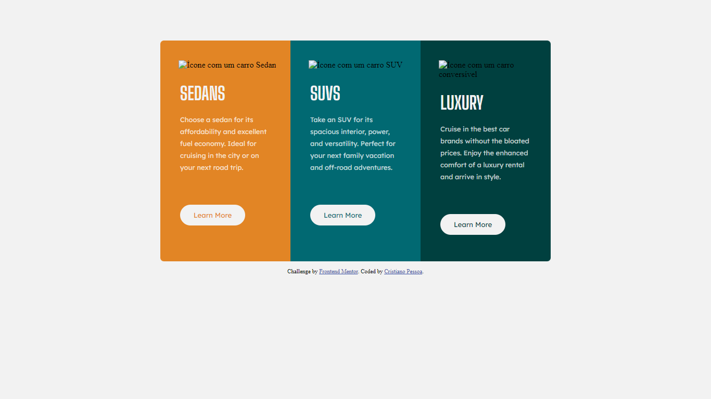

# Frontend Mentor - 3-column preview card component solution

This is a solution to the [3-column preview card component challenge on Frontend Mentor](https://www.frontendmentor.io/challenges/3column-preview-card-component-pH92eAR2-). Frontend Mentor challenges help you improve your coding skills by building realistic projects. 

## Table of contents

- [Overview](#overview)
  - [The challenge](#the-challenge)
  - [Screenshot](#screenshot)
  - [Links](#links)
- [My process](#my-process)
  - [Built with](#built-with)
  - [What I learned](#what-i-learned)
  - [Continued development](#continued-development)
  - [Useful resources](#useful-resources)
- [Author](#author)
- [Acknowledgments](#acknowledgments)

## Overview

### The challenge

Users should be able to:

- View the optimal layout depending on their device's screen size
- See hover states for interactive elements

### Screenshot




### Links

- Solution URL: (https://myfifthproject.vercel.app/)

## My process

### Built with

- Semantic HTML5 markup
- CSS custom properties
- Flexbox
- CSS Grid
- Visual Code Editor


### What I learned

I learned how i can from one div, create some divs inside the div and give different properties to each one of them and create a beautiful multi-color card. Also i learned how to set the border-radius to only two corners of the div with the following way:
```css
#sedans {
border-radius: 7px 0px 0px 7px;
}
```
I learned a lot about margins though, how many things can be placed in the right place with margins also.

### Continued development

I want to improve in flexbox because it's a very important technique in our todays world and i'm still kind of confused in flexbox, also i want to improve my styles, like being able to identify the color, font size etc just by look at the image, acquire more experience at programming, learn a programming language like JavaScript, get better at CSS.

### Useful resources

- [MDN DOCS WEB Article about border-radius](https://developer.mozilla.org/en-US/docs/Web/CSS/border-radius) - This article helped me understand how can i set the border-radius to only some corners of the divs and don't need to be all 4 corners at once.
- [Game about Grid Layout](https://codingfantasy.com/games/css-grid-attack/play) - This amazing game mad eme understand grid layout and how i could use it on my solution, it helped me out a lot.

## Author

- Author's Name - [Cristiano Pessoa Ferreira Magalhães]
- Frontend Mentor - [@CristianoAAA](https://www.frontendmentor.io/profile/CristianoAAA)
- Instagram - [@cris_pfmf](https://www.instagram.com/cris_pfmf/)


## Acknowledgments

I want to thank a buddy from Frontend Mentor's discord who helped me when i was stuck in the challenge, his name is Dimas_Okr. Thanks a lot!
